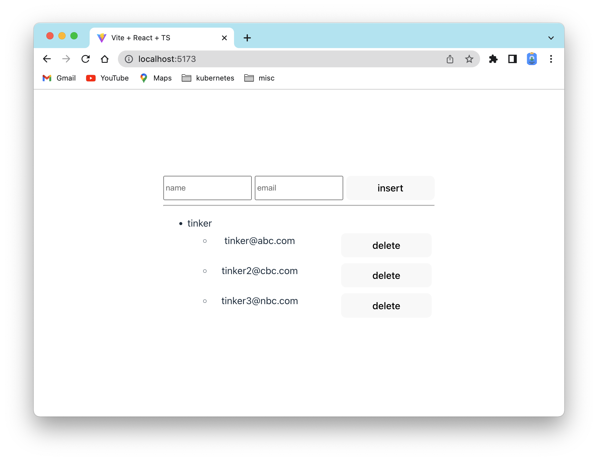

# contact
1. add contact with multiple emails
1. group emails per person
1. indicate input error for 2 seconds
1. disable input if there is an error
1. able to delete emails
1. layout the contact like the following:
   